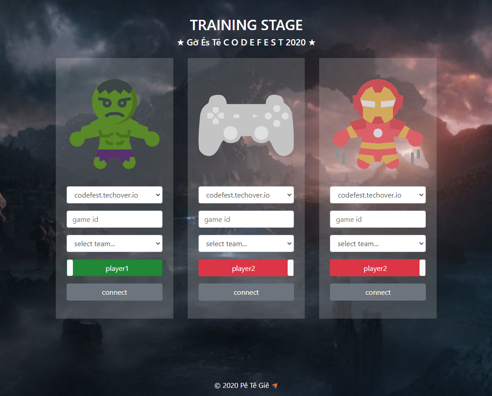

**ivengers** is ...

## Overview



## Features

## Requirements
* [Node.js](https://nodejs.org/)
* [NPM](https://docs.npmjs.com/cli/v6/commands/npm-install/) or [Yarn](https://yarnpkg.com/)
* [Lerna](https://lerna.js.org/)

## Building

Install lerna:
```bash
npm install -g lerna
```

Install dependency:
```bash
npm install
```

Link packages dependency
```bash
lerna bootstrap
```

Update host/key in packages/browser/.env

Runs the app in development mode on browser:
```bash
lerna run start-browser
```
